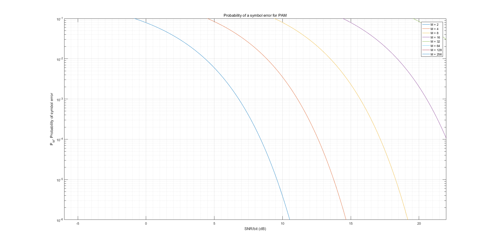

# Probability of a symbol error for PAM

- ### Description
  Plot the SNR Vs Probability of a symbol error for M-ary PAM.
  Author: undecV
  17 May 2017.

- ### Figure
    

- ### Code
    ``` matlab
    ...
    ```

- ### Reference

  - **Essentials Of Communication System Engineering**
    Author: Proakis and Salehi
    ISBN: 9810675526
    Page: 433 - 434
  - **Contemporary Communication Systems Using MATLAB**
    Author: John G. Proakis，Masoud Salehi，Gerhard Bauch
    ISBN: 9780495082514
    Page: 223 - 225
    https://books.google.com.tw/books?id=UZiJzjv9UUgC&pg=PA225&lpg=PA225&dq=MATLAB+PAM+SNR&source=bl&ots=zNdhUY61k5&sig=0CVOx0oGvX-Y7EG4uuc3U2rHjJk&hl=zh-TW&sa=X&ved=0ahUKEwi43KnjjffTAhUEupQKHSq5ARoQ6AEIeTAJ#v=onepage&q=MATLAB%20PAM%20SNR&f=false
  - **Digital iVision Labs!: MATLAB SNR Vs Probability of Symbol Error Curve For M-ary QAM in AWGN channel: Error Probability Curve For M-ary QAM**
    http://www.divilabs.com/2015/04/matlab-snr-vs-probability-of-symbol.html

---

Probability of a symbol error for PAM
